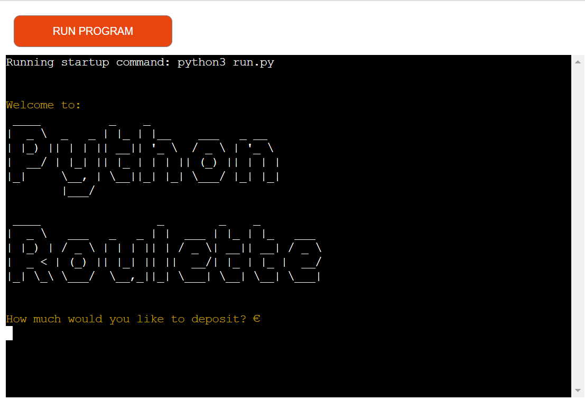
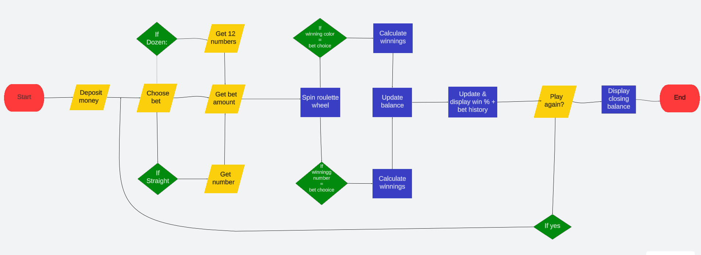
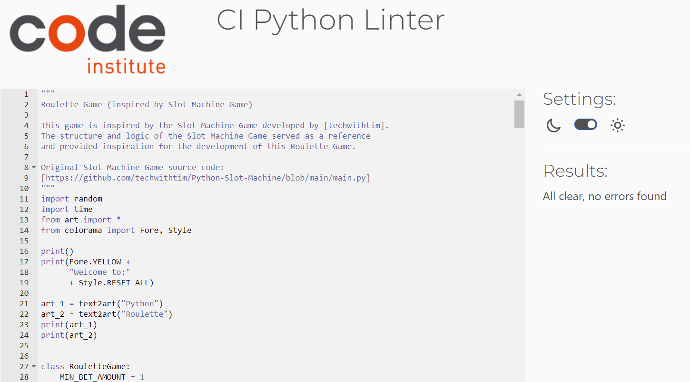

# Python Roulette

This is a command-line Roulette game implemented in Python. The game simulates a roulette wheel and allows players to place bets on various outcomes, such as colours (Red or Black), odd or even numbers, specific numbers (Straight bets) or Dozen (twelve numbers). Players can choose their desired bet type, place bet amount within range and spin the roulette wheel to determine the winning outcome. The game calculates the winnings based on the player's bet and displays the result.

Follow this link to the live site [Python Roulette](https://roulette-python-e6aefa000cea.herokuapp.com/)

# Contents

- [Objective](<#Objective>)
- [Installation and Setup](<#installation-and-setup>)
- [How to play](<#How-to-play>)
- [User Experience](<#user-experience-ux>)
     - [Site Aims](<#site-aims>)
     - [Flowchart](<#flowchart>)
- [Features](<#features>)
- [Future Features](<#future-features>)
- [Code Structure](<#code-structure>)
- [Technologies Used](<#technologies-used>)
- [Dependencies](<#dependencies>)
- [Testing](<#testing>)
    - [Code Validation](<#code-validation>)
    - [Manual Testing](<#manual-testing>)
- [Unresolved Bugs](<unresolved-bugs>)
- [Deployment](<#deployment>)
- [Disclaimer](<#disclaimer>)
- [Acknowledgements](<#acknowledgements>)

# Objective

The aim of this project is to create an interactive Roulette game that provides the user with an enjoyable and realisitic gaming experience. The game should accurately simulate a roulette wheel, allow users to place different types of bets and provide feedback on the outcomes and winings.

# Installation and Setup

1. Python Installation:
   - Ensure that you have Python 3.x installed on your system. If not, you can download and install Python from the official Python website (https://www.python.org).
2. Required Dependencies:
   - This Roulette game relies on the 'colorama' library for coloured text output. You can install it using pip, the Python package installer.
     Open a command prompt or terminal and execute the following command:
     pip install colorama
3. Download the Game Files:
   - Download the Roulette Game source code from the repository on GitHub. You can clone the repository using Git or download it as a ZIP file and extract it to your desired location.
4. Navigate to the Game Directory:
   - Using the command prompt or terminal, navigate to the directory where you extracted the game files:
     cd /path/to/roulette-game
5. Run the Game:
   - Once you are in the game directory, run the game by executing the following command:
     python3 run.py
6. Enjoy the Game:
   - The Roulette Game should now start running, and you can start playing and placing your bets.

Note: Make sure you have an active internet connection, as the game uses random number generation for the wheel spin.

# How to play

1. Run the "roulette_game.py" file in a Python environment.
2. The game will prompt you to deposit money into your account. Enter your desired amount to start playing.
3. Choose your bet type by entering the corresponding number: 
    - 1: Red
    - 2: Black
    - 3: Odd
    - 4: Even
    - 5: Green
    - 6: Straight (requires entering a specific number from 1 to 36)
    - 7: Dozen (requires a list of twelve numbers from 1 to 36)
4. Enter the amount you wish to bet, within the range allowed.
5. The roulette wheel will spin and the winning outcome will be displayed.
6. If you win, your balance will be updated with your earnings, otherwise it will deduct the amount of the bet placed.
7. At the end of each spin you will have the option to play again or leave the table.
8. When you decide to leave the table you will be informed of your closing balance amount.

# User Experience (UX)

## Site Aims
The primary aim of Python Roulette is to enterain users by offering a realisitic and engaging virtual gambling experience. The game should be easy to understand and navigate, allowing users to place bets effortlessly and enjoy the excitement of spinning the roulette wheel.

| ID | ROLE | EXPECTATIONS | TARGET |
|----|------|--------------|--------|
| 1  | User | As a player, I expect to deposit my money into my account before playing. | To allow me the opportunity to place money on a bet. |
| 2  | User | As a player, I expect the choice of choosing my desired type of bet and place said bet amount within the range allowed in the game. | Therefore allowing me the opportunity for flexibility. |
| 3  | User | As a player, I want to know if I won or lost the bet and see the winnings, if applicable. | To allow for transparency and feedback, it evaluates the effectiveness of my betting strategies. |
| 4  | User | As a player, I want to be able to play again or leave the table. | To allow for convenience and accessibility. |
| 5  | User | As a player, I want my account balance to be updated based on the outcome and winnings of each bet. | To allow for financial management. It provides essential information for decision-making, strategy development, and goal setting. |

## Flowchart

# Features

## RouletteGame class

- The code defines a RouletteGame class that encapsulates the game logic and data. 
- It handles user interactions, manages the game state, and tracks the user's balance, betting history, and win statistics,

## User Interface

- Python Roulette uses the colorama library to add color and style to the console output, enhancing the user experience.

## Game Initialization

- Upon starting the game, the user is prompted to add money to their account by specifying the deposit amount.
- The entered amount is validated, and the balance is updated accordingly.

## Choosing type of bet

- Asking players to choose their preferred bet type (Red, Black, Odd, Even, Green, Straight and Dozen) improves their entertainment, offers customisation, provides strategic decision-making opportunities and adds variety to the gameplay experience.
- It allows players to place their bets with their personalised choices, gameplan or gut instinct which makes the game more captivating and engaging.

## Bet allowances

- To promote fairness, financial planning and sensible gambling the game asks players to bet within the game's allowance.
- This ensures players can allow for more decision-making, encourages risk manangement and adds to the game's balance.
- These boundaries creates a regulated environment for the player to safely enjoy the roulette experience.

## Spinning roulette wheel

- Spinning the roulette wheel and finding out the winning outcomes provides excitment, spontanety, realisim and transparency for the user to enhance their engagment with the game.
- It gives clear feedback, ensures fairness and is an entertaining process in the gameplay.
- This is an important part of the game as it adds depth, excitement and originality to the roulette game experience.

## Winning calculations

- Calculating and displaying winnings based on the bet and outcome of the roulette wheel spin gives the user feedback, provides them with a reward and facilitates financial management.
- It gives the user a sense of satisfation and purpose which further contributes to the game's enjoyability.

## Betting history tracking

- At the end of each spin of the wheel the user's bet and stake along with the outcome of the bet is displayed to the user.
- This provides the user with a comprehensive overview of their betting activity throughout the game.

## Update account balance

- This is crucial in order to allow the user to make in-game decisions, offers financial management and provides the user with fulfillment when they are successful. 
- They can then use this information to make informed choices based on their winnings and/or losses.

## Play again or leave table

- The option to play again or leave the table allows the user flexibility in making their decisions based on their convenience, time and financial management.
- This makes sure that Python Roulette's approach is user-centered and offers a authentic experience to each player of the game.

# Future Features

- Implement different betting strategies for a more advanced gameplay.
- Add support for multiple players to join and allow them to compete together.
- Include additional statistics and analysis of gameplay, such as win/loss ratio, winning streaks and other relevant data.
- Different roulette variations: Include support for different variations of roulette, such as European, American, or French roulette.

# Code Structure
- roulette_game.py: Main file containing the RouletteGame class and the game logic.
- __init__: Initialises the game object and sets the initial balance and betting history.
- add_money: Prompts the user to add money to their game account.
- get_bet_choice: Prompts the user to choose a bet type.
- get_straight_number: Prompts the user to enter a specific number for a straight bet.
- get_dozen_list: Prompts the user to enter 12 numbers for a dozen bet.
- get_bet_amount: Prompts the user to enter the bet amount.
- spin_animation: Displays a spinning animation before and after spinning the roulette wheel.
- spin_roulette_wheel: Simulates the spinning of the roulette wheel and returns the winning number and colour.
- check_winnings: Checks if the user has won any money based on the bet and the wheel outcome.
- play_game: Main game loop that handles the entire gameplay process.
- display_betting_history: Displays the user's betting history.
- display_winning_percentage: Displays the user's win percentage.
- play: Starts the game and allows the user to play multiple rounds.

# Technologies Used

Python Roulette utilises the following technologies:

Python: The application is built using the Python programming language. Python provides a versatile and powerful environment for developing interactive and dynamic applications.

Colorama: Colorama is a Python library used for adding colour and style to the text output in the terminal. It enhances the visual appearance of the game by allowing the use of different colours and formatting options.

Art: Art is a Python library used for generating ASCII art. It enables the creation of visually appealing text-based graphics and adds an aesthetic touch to the game's visual elements.

Heroku: Heroku is a cloud platform that is used for deploying and hosting the Python Roulette application. It provides a reliable and scalable infrastructure for running web applications.

Git: Git is a distributed version control system used for managing and tracking changes to the source code. It allows for collaborative development and ensures the project's history and revisions are properly maintained.

GitHub: GitHub is a web-based platform for hosting and sharing Git repositories. It provides a convenient way to store and manage the project's source code, as well as facilitating collaboration and version control.

Code Institute Backend Template: Code Institute provides a backend template designed to display the Python Roulette application in a modern web browser. This template enables easy accessibility for users without the need for additional software other than a web browser.

These technologies work together to create an engaging and interactive gaming experience in Python Roulette.

# Dependencies

Ensure that all the dependencies are installed correctly before running the Python Roulette application to avoid any potential issues or errors.

Python Roulette relies on the following dependencies:

- Python 3.x: The application was created using Python 3.x version. Ensure that you have Python 3.x installed on your system before running the program.

- colorama library: This library is used to add colour and style to the text output in the terminal. To install colorama, open a terminal or command prompt and run the following command:

pip install colorama

This will install the colorama library and make it available for the Python Roulette application to use.

- art library: The art library is utilised to generate ASCII art for visual elements in the game. To install the art library, open a terminal or command prompt and run the following command:

pip install art

This will install the art library and enable Python Roulette to generate visually appealing ASCII art.

# Testing

## Code Validation

Python Roulette was thoroughly tested during its development using Code Institute's Python Linter, which helps ensure adherence to the Python code style guidelines.

Throughout the testing process, the linter reported various issues such as "trailing whitespaces," "under-indented lines," and "too many blank lines". These issues were promptly addressed and resolved, resulting in clean and well-formatted code.

By utilising the Python Linter, the project's code was reviewed and validated to meet the recommended coding standards, enhancing code readability, maintainability, and overall quality.

## Manual Testing

| Action        | Expected           | Actual  |
| ------------- |:-------------:| -----:|
| Deposit money into the account | The account balance should update accordingly | Account balance is correctly updated |
| Deposit -€10 into the account | Display an error message stating that the deposit amount must be positive | Error message is displayed, preventing a negative deposit |
| Choose a bet type (e.g. Red, Odd) | The chosen bet type should be registered| Bet type is correctly registered |
| Choose a bet type by entering invalid type (e.g. letter, 7) | Display an error message indicating that an invalid bet choice was entered | Error message is displayed, informing the user about the invalid bet choice |
| Choose a straight bet and enter a number outside the range of 1-36 (e.g., 50) | Display an error message stating that the straight bet number is invalid | Error message is displayed, informing the user that the entered number is outside the valid range |
| Enter a valid bet amount within the allowed range | The bet amount should be accepted | The bet amount is accepted |
| Enter a bet amount of €1000 when the account balance is €500 | Display an error message indicating that the bet amount exceeds the account balance | Error message is displayed, informing the user that the bet amount is higher than the account balance |
| Spin the roulette wheel | The wheel should spin and land on random number and colour | The roulette wheel spins and successfully lands on a random number and colour |
| Check the bet outcome | Based on the outcome of the spin the game should determine if the bet is correct or incorrect | Outcome of the bet is correctly determined |
| Display winnings if bet is successful | If the bet wins the winnings should be displayed to the user | Winnings are correctly displayed |
| Track and display betting history | The type of bet, user's stake and whether they won or lost should be displayed at the end of each spin | Betting history is correctly displayed |
| Option to play again or leave table is prompted |The player should have the option to quit the game or continue playing | The option to play or leave is correctly provided |
| Repeat the steps to play another round | The game should allow for multiple rounds of gameplay | Multiple rounds of gameplay is possible |
| Exhaust the account balance by repeatedly placing bets | Display a message indicating that the account balance is empty and prompt the user to add more money | Message is displayed, informing the user about the empty account balance and requesting to add more money |
| Verify the user's final balance upon exiting the game | The user's final balance should be correctly updated and displayed | The user's final balance is correctly displayed |
| Test various invalid inputs | Enter invalid inputs in various fields | The game correctly handles invalid inputs |

# Unresolved Bugs

There has been no bugs reported.

# Deployment 

This application has been deployed using the Heroku cloud platform. Follow the steps below to replicate the deployment process:

Local Deployment:

Clone the repository by running the following command in your intergrated development environment (IDE):

Heroku Deployment:

1. Create an account on Heroku [https://www.heroku.com/] if you haven't already done so.
2. Log in to your Heroku Dashboard and click on "New".
3. Select "Create new app" from the dropdown menu and give the application a unique name.
4. Choose the region closest to you.
5. Click "Create App" to create your application.
6. In your newly created application's settings, click on "Reveal Config Vars".
7. Add the config var:
   KEY: PORT, VALUE: 8000
8. To add support for dependencies, click on "Add Buildpack".
9. Add Python as the first dependency, followed by Node.js.
10. Select "Manual Deployment" to manually deploy from your branch.
Alternatively, you can select "Enable Automatic Deploy" to automatically project your project when you push a new commit.
11. After completing the above steps, your Heroku app will need two files for successful deployment: requirements.txt and Procfile.
12. Install the project's requirements by running the following command:
   pip install -r requirments.txt

By following these steps, you can deploy the Python Roulette application on Heroku and make it accessible to users.

# Disclaimer

This program is a gambling simulation and does not involve real money. It is intended for education and entertainment purposes only.

# Acknowledgements

- The Roulette Game was inspired by the Slot Machine Game developed by techwithtim.
- The structure and logic of the Slot Machine Game served as a reference and provided inspiration for the development of this Roulette Game.
- Original Slot Machine Game source code: [techwithtim](https://github.com/techwithtim/Python-Slot-Machine/blob/main/main.py)
- I want to thank my mentor, Code Institute's Mentor Assistance and all the members of the Slack community for their support and guidance throughout the creation of this project.

